Brian Stucker - M365 Core / X3 Design - Jan 16, 2026

# Installing Claude Code

Please read carefully.Claude Code is approved for internal use [following these requirements](https://eng.ms/docs/experiences-devices/global-experiences-platform/es365/claude-code-for-ed/claude-code-docs/restrictions) which are summarized below:

- Only use Claude Code if you reside and work in one of the supported countries or regions: [supported countries and regions](https://www.anthropic.com/supported-countries).

## Need More Help or Support?

Start with the [Pilot Users channel](https://nam06.safelinks.protection.outlook.com/?url=https%3A%2F%2Fteams.microsoft.com%2Fl%2Fchannel%2F19%253AKohb9AeZSDFTwy0zUZ-osLhXk8Xf3CeUvRqothgmvt41%2540thread.tacv2%2FPilot%2520Users%3FgroupId%3D294164cf-41ac-43cd-b4b7-8a1fe0b441f7%26tenantId%3D72f988bf-86f1-41af-91ab-2d7cd011db47\&data=05%7C02%7Cbstucker%40microsoft.com%7C023abed776124d65737e08de52d81ff2%7C72f988bf86f141af91ab2d7cd011db47%7C1%7C0%7C639039285511095707%7CUnknown%7CTWFpbGZsb3d8eyJFbXB0eU1hcGkiOnRydWUsIlYiOiIwLjAuMDAwMCIsIlAiOiJXaW4zMiIsIkFOIjoiTWFpbCIsIldUIjoyfQ%3D%3D%7C0%7C%7C%7C\&sdata=o%2FjfKamCasV8fN244YRWmjSnoEnLS%2BnTXPQu9wsk5Ek%3D\&reserved=0) for support, Q\&A and more. For escalations, contact <exdclaudeadmins@microsoft.com> (be patient, this team is scaling across E+D- the quickest way to slow them down is to repeatedly ask them for access).

## Step1: CheckAccess

Verify access:

- Go to [console.anthropic.com](https://console.anthropic.com/) and confirm you can log in using SSO with your `alias@microsoft.com` email


If everything is working, you should see the following once you have logged in with your \<alias>@microsoft.com account via SSO

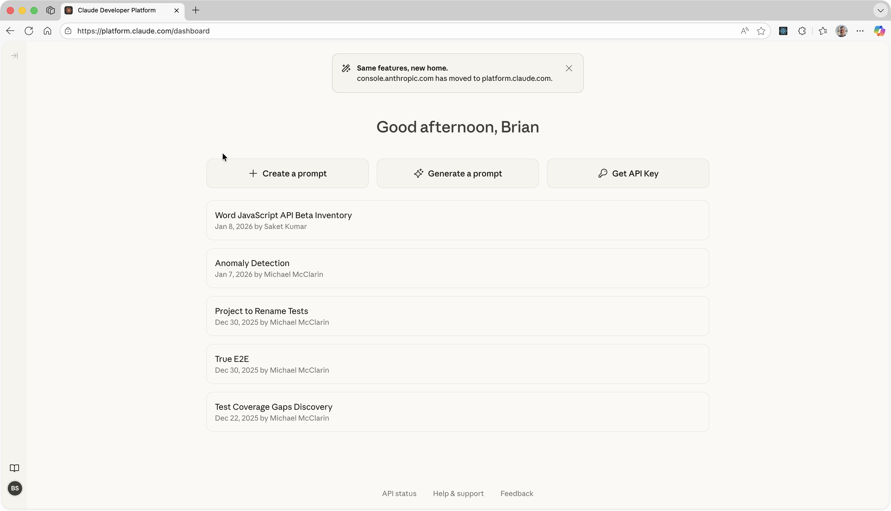

## Step2: InstallAgency

### What is agency

Agency (<https://aka.ms/agency>) isanagent platform for Microsoft engineers. `agency` CLI helps install and configure GitHub Copilot CLI, Claude Code CLI, MCP tools, and AI repo tools. [Learn more](https://aka.ms/agency)

‼️Make sure to restart your terminal window after installing agency. Otherwise when you try to run it, it will say it is not found.

### Windows

Open theStartmenu, typeWindows PowerShell, selectWindows PowerShell, then selectOpen.

Then paste in the command below and hit enter. This should result in agency being installed on your machine.

```powershell
iex "& { $(irm aka.ms/InstallTool.ps1)} agency"
```

### MacOS

### Opening a TerminalWindow

UseCommand (⌘) + Spaceto bring up spotlight search, then type in `terminal` and hit enter


Intheterminal window, copy paste the following into the command line and hit enter.

```shell
curl -sSfL https://aka.ms/InstallTool.sh | sh -s agency
```

You should then see something that looks like what's below. This is the installer being downloaded and then installed.

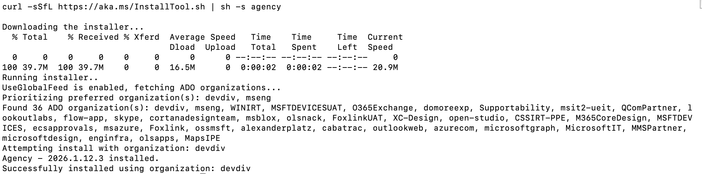

### Linux

```shell
curl -sSfL https://aka.ms/InstallToolLinux.sh | sh -s agency
```

After installing `agency` you can access:

|   | Tool               | Command          |
| - | ------------------ | ---------------- |
| 1 | GitHub Copilot CLI | `agency copilot` |
| 2 | Claude Code        | `agency claude`  |
| 3 | MCP Tools          | `agency mcp`     |
| 4 | AI Repo Tools      | `agency repo`    |

New

We encourage you to try both `agency claude` as well as `agency copilot` and compare results. The GitHub team would love your feedback. Please share your thoughts on the [Copilot CLI Teams channel](https://teams.microsoft.com/l/channel/19%3A3a10724f969043c3aab0d68a939500d1%40thread.tacv2/Copilot%20CLI?groupId=5f134ecd-5789-499a-b782-1f6f2dec34de\&tenantId=72f988bf-86f1-41af-91ab-2d7cd011db47) so the team can continue to improve this offering.

## Step 3: StartClaudeCode

```shell
agency claude
```

This will:

- InstallClaude Codeand its dependencies.

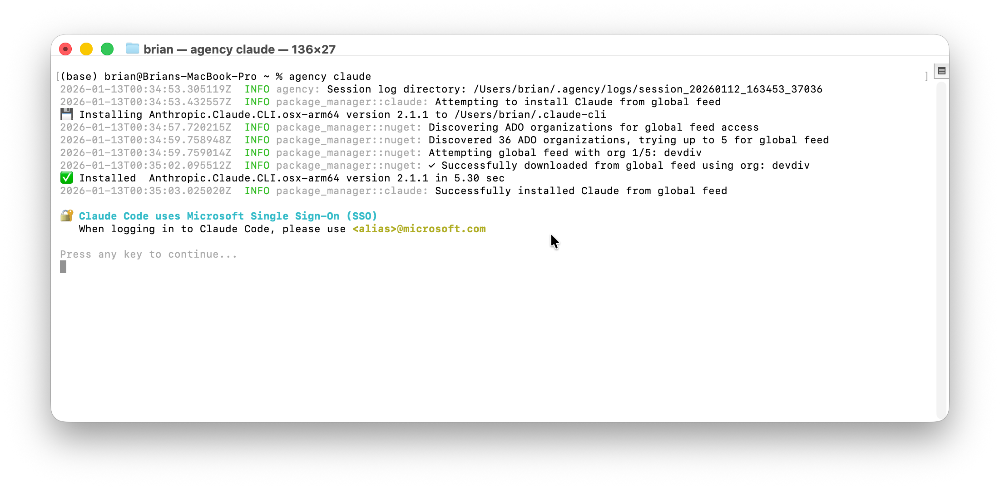

### Complete browser authentication

- Your browsermayopen to the console login page


### 🚨Troubleshooting: I got an"agencynot found"error

If you try running `agency claude` from the command line / terminal and you see something like the following:


This problem is caused by running the installer and then trying to run agencyback to back in the same terminal session. Part of the setup tells your OS where to find the new tool. This orientation step runs automatically when you open a new terminal window. The command `which agency` asks the OS (in this case macOS) "which program called agency will run?" When the OS says "agency not found" it's telling you that it doesn't know where to look. You can open a new terminal window or you can cheat and run the step that orients the OS yourself by typing inin the terminal.


### 🚨Troubleshooting: I got an"Claude Code requires git-bash"error

If you try running `agency claude` from the command linein windowsand you see something like the following:

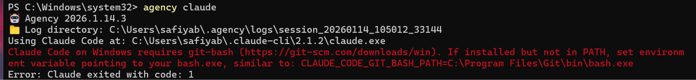

This problem is discussed in Anthropic's Claude Code [support and troubleshooting guide](https://code.claude.com/docs/en/troubleshooting#windows:-%E2%80%9Cclaude-code-on-windows-requires-git-bash%E2%80%9D).

## Step4:Setup Claude Code

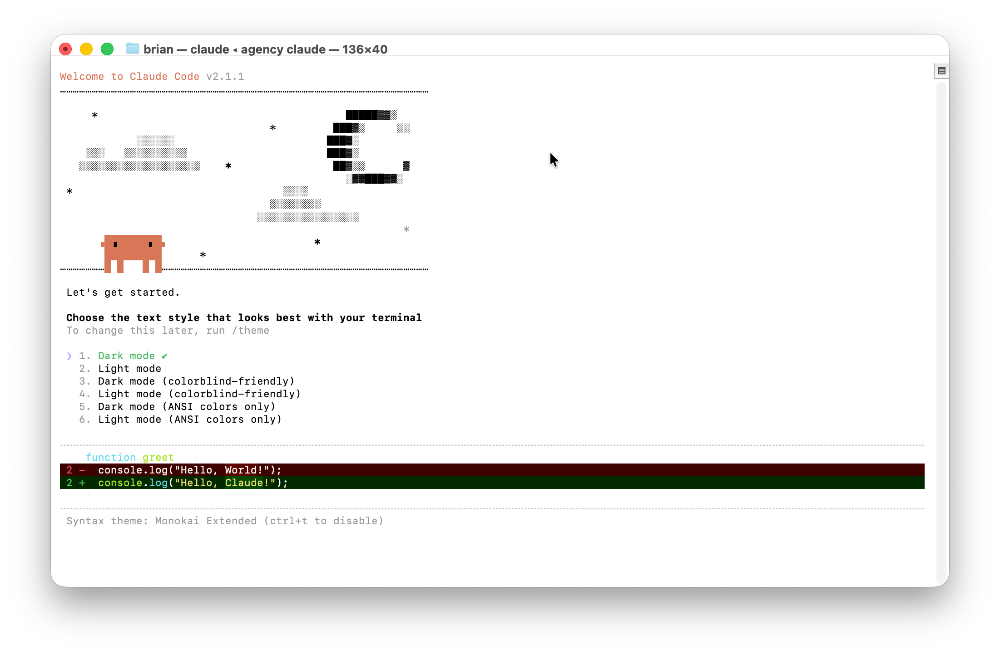

Once you select a theme in Claude Code, you will be directed to a new browser tab to authorize Claude Code to connect with Anthropic.

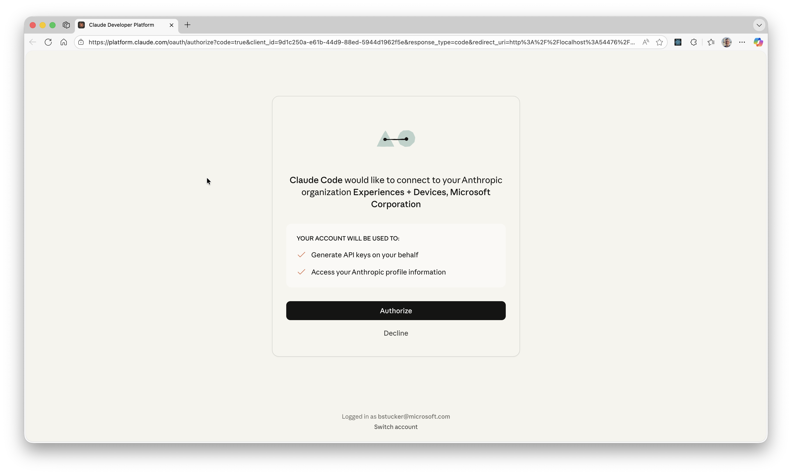


DO NOT let Claude Code have access to important directories on your machine.⬇️

By default your terminal window will open in the \~ directory (this is your home directory, shown here for me as /Users/brian). This directory houses all your documents, downloads, setup files, SSH keys... This is a very bad directory to give it access to. Never give agents access to this directory. So we are going tohit ESC to cancel.


Run the following commands to make a new directory called Claude under your \~ directory.

Shell

```
cd ~
mkdir Claude
cd Claude
```

Show more lines

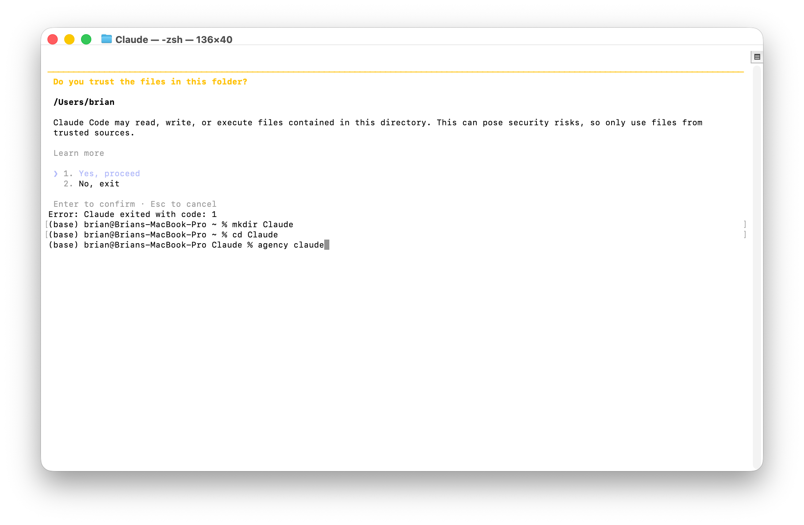

Now go ahead and restart claude by entering `2` again.


Now we are cooking. Every time you open up claude code you willl be asked if you trust the files in the folder that claude opened in. Always pay attention to this question and answer NO if you don't know what to do.

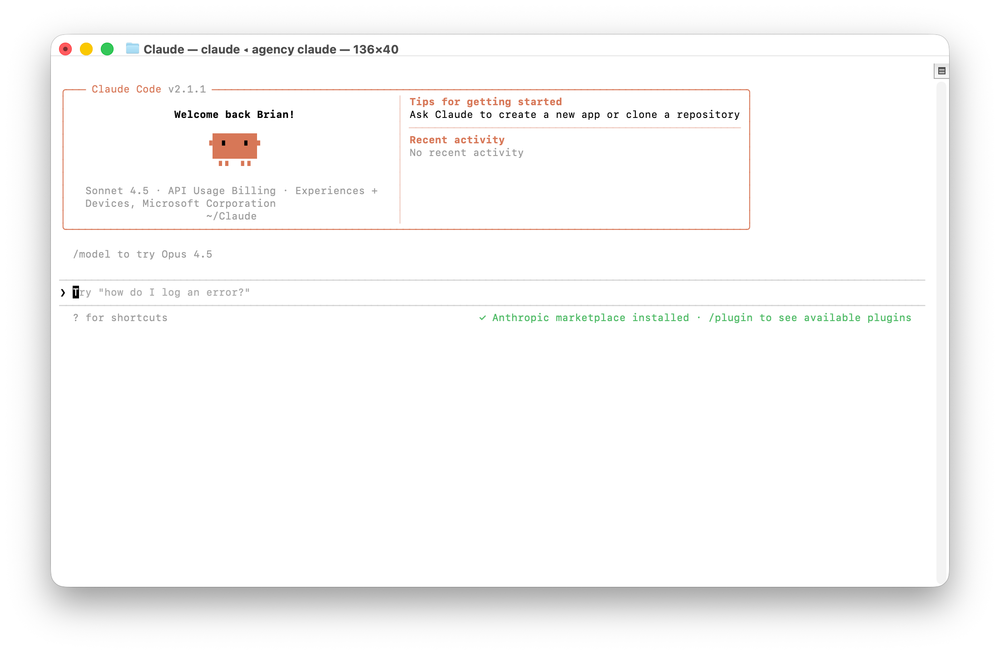

Now, for macOS, here is a way to create a nice shortcut for the new \~/Claude folder that you made. In finder, click on Go then Go to Folder

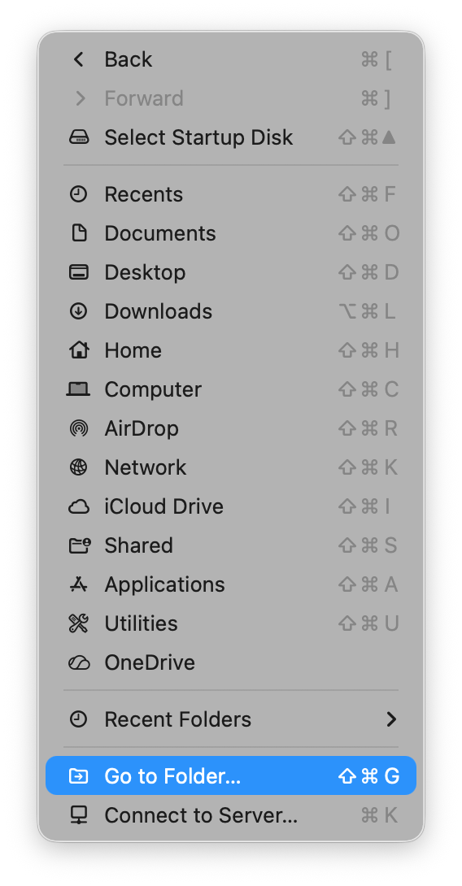

Then type in/Claude `~/Claude`

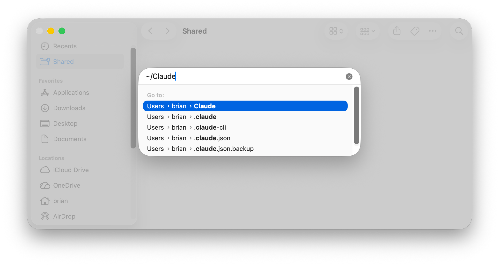

Once you are in the folder, now you can click File / Add toDock(or "Add to Sidebar")which will add it to the Finder's left nav list

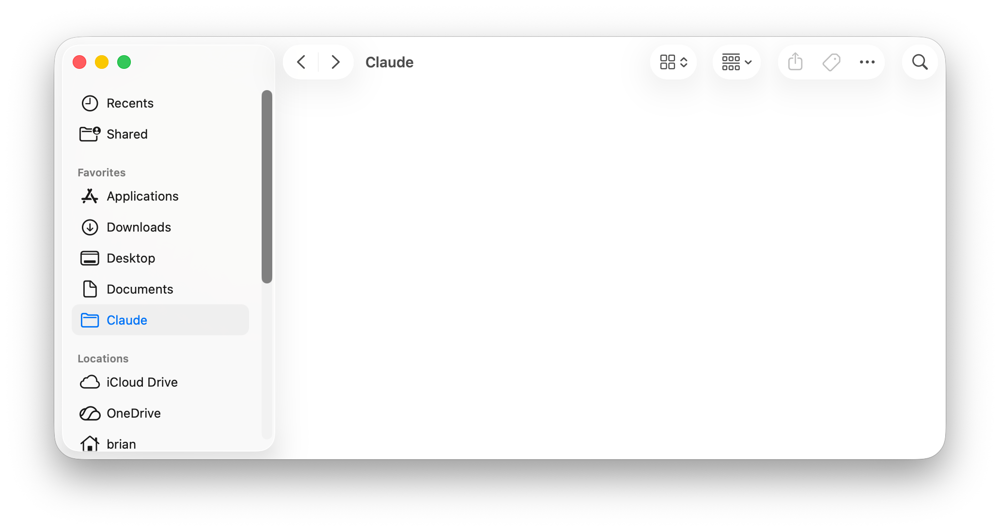

## Optional: Create Projects and Run ClaudeCodefromFolder

As you use Claude Code you will want to keep the files for different projects separate from one another. In your `~/Claude` folder you can create new folders for each Project. Right-click on the folder and click on New Terminal at Folder will open the terminal in that folder.


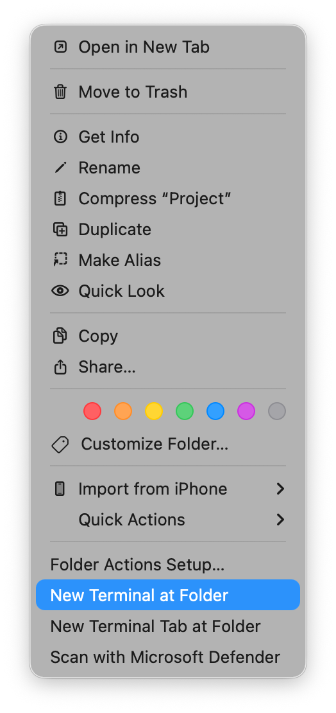

You can always verify the folder you're in by typing `pwd` which means "print working directory." It's a good habit to get into until you're confident that you're where you expect to be.

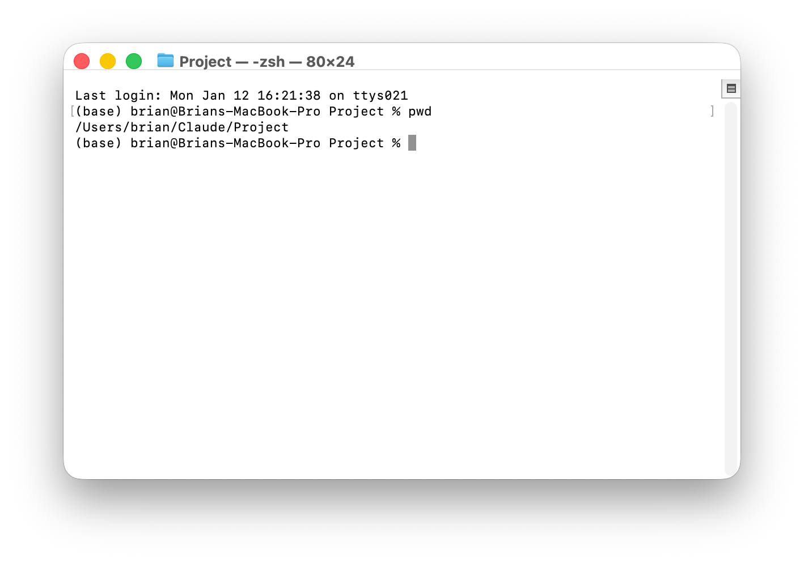

Once your terminal is in the right folder you can run agency claude to start a new copy of Claude Code in that project space.

## Optional: Additional Resources to Level Up Your Skills

· [How Anthropic Teams use Claude Code](https://nam06.safelinks.protection.outlook.com/?url=https%3A%2F%2Fwww.anthropic.com%2Fnews%2Fhow-anthropic-teams-use-claude-code\&data=05%7C02%7Cbstucker%40microsoft.com%7C023abed776124d65737e08de52d81ff2%7C72f988bf86f141af91ab2d7cd011db47%7C1%7C0%7C639039285510726172%7CUnknown%7CTWFpbGZsb3d8eyJFbXB0eU1hcGkiOnRydWUsIlYiOiIwLjAuMDAwMCIsIlAiOiJXaW4zMiIsIkFOIjoiTWFpbCIsIldUIjoyfQ%3D%3D%7C0%7C%7C%7C\&sdata=h5PeegTxVZvsII7fXs%2BVkTdE1PQBR1bmGX1BjPQtOG0%3D\&reserved=0)

· [Claude Code Documentation](https://nam06.safelinks.protection.outlook.com/?url=https%3A%2F%2Fcode.claude.com%2Fdocs\&data=05%7C02%7Cbstucker%40microsoft.com%7C023abed776124d65737e08de52d81ff2%7C72f988bf86f141af91ab2d7cd011db47%7C1%7C0%7C639039285510738531%7CUnknown%7CTWFpbGZsb3d8eyJFbXB0eU1hcGkiOnRydWUsIlYiOiIwLjAuMDAwMCIsIlAiOiJXaW4zMiIsIkFOIjoiTWFpbCIsIldUIjoyfQ%3D%3D%7C0%7C%7C%7C\&sdata=XbMf1qcKgw3nVcwltyIdcs9ST6DYMQa%2BvN7TaIk4zkU%3D\&reserved=0)

· [Product Page](https://nam06.safelinks.protection.outlook.com/?url=https%3A%2F%2Fclaude.com%2Fproduct%2Fclaude-code\&data=05%7C02%7Cbstucker%40microsoft.com%7C023abed776124d65737e08de52d81ff2%7C72f988bf86f141af91ab2d7cd011db47%7C1%7C0%7C639039285510750602%7CUnknown%7CTWFpbGZsb3d8eyJFbXB0eU1hcGkiOnRydWUsIlYiOiIwLjAuMDAwMCIsIlAiOiJXaW4zMiIsIkFOIjoiTWFpbCIsIldUIjoyfQ%3D%3D%7C0%7C%7C%7C\&sdata=HeZvDQiy95HgK0G9t%2B5mEEPDQGwxLCyY6aiyReWgTjE%3D\&reserved=0)

· [Quick Start Docs](https://nam06.safelinks.protection.outlook.com/?url=https%3A%2F%2Fcode.claude.com%2Fdocs%2Fen%2Fquickstart\&data=05%7C02%7Cbstucker%40microsoft.com%7C023abed776124d65737e08de52d81ff2%7C72f988bf86f141af91ab2d7cd011db47%7C1%7C0%7C639039285510762816%7CUnknown%7CTWFpbGZsb3d8eyJFbXB0eU1hcGkiOnRydWUsIlYiOiIwLjAuMDAwMCIsIlAiOiJXaW4zMiIsIkFOIjoiTWFpbCIsIldUIjoyfQ%3D%3D%7C0%7C%7C%7C\&sdata=ik7MifjNxZ1VZcD2d9Mduzu8Sv0%2FSrqy0xm%2B2DA59%2BY%3D\&reserved=0)

· [Engineering Blog + Sandboxing](https://nam06.safelinks.protection.outlook.com/?url=https%3A%2F%2Fwww.anthropic.com%2Fengineering%2Fclaude-code-sandboxing\&data=05%7C02%7Cbstucker%40microsoft.com%7C023abed776124d65737e08de52d81ff2%7C72f988bf86f141af91ab2d7cd011db47%7C1%7C0%7C639039285510774896%7CUnknown%7CTWFpbGZsb3d8eyJFbXB0eU1hcGkiOnRydWUsIlYiOiIwLjAuMDAwMCIsIlAiOiJXaW4zMiIsIkFOIjoiTWFpbCIsIldUIjoyfQ%3D%3D%7C0%7C%7C%7C\&sdata=FzPM3r1r6pdw7uLRQWPyZwwdwjNJeCvIYLduQvj2eMg%3D\&reserved=0)

· [Claude Code GitHub Repository](https://nam06.safelinks.protection.outlook.com/?url=https%3A%2F%2Fgithub.com%2Fanthropics%2Fclaude-code\&data=05%7C02%7Cbstucker%40microsoft.com%7C023abed776124d65737e08de52d81ff2%7C72f988bf86f141af91ab2d7cd011db47%7C1%7C0%7C639039285510787942%7CUnknown%7CTWFpbGZsb3d8eyJFbXB0eU1hcGkiOnRydWUsIlYiOiIwLjAuMDAwMCIsIlAiOiJXaW4zMiIsIkFOIjoiTWFpbCIsIldUIjoyfQ%3D%3D%7C0%7C%7C%7C\&sdata=RpFHUoTo2PSP0rz5vKvZLgNAN8u8VHbZhZFs9ESgAFc%3D\&reserved=0)

· [Code w/ Claude Developer Conference](https://nam06.safelinks.protection.outlook.com/?url=https%3A%2F%2Fwww.youtube.com%2Fplaylist%3Flist%3DPLf2m23nhTg1P5BsOHUOXyQz5RhfUSSVUi\&data=05%7C02%7Cbstucker%40microsoft.com%7C023abed776124d65737e08de52d81ff2%7C72f988bf86f141af91ab2d7cd011db47%7C1%7C0%7C639039285510812049%7CUnknown%7CTWFpbGZsb3d8eyJFbXB0eU1hcGkiOnRydWUsIlYiOiIwLjAuMDAwMCIsIlAiOiJXaW4zMiIsIkFOIjoiTWFpbCIsIldUIjoyfQ%3D%3D%7C0%7C%7C%7C\&sdata=9WVuvPv7xz%2BMG2aJmVial1x5BJASSLPEn4whjLz8i9E%3D\&reserved=0)

· [Analysis of top coding patterns across Claude users](https://nam06.safelinks.protection.outlook.com/?url=https%3A%2F%2Fwww.anthropic.com%2Fresearch%2Fimpact-software-development\&data=05%7C02%7Cbstucker%40microsoft.com%7C023abed776124d65737e08de52d81ff2%7C72f988bf86f141af91ab2d7cd011db47%7C1%7C0%7C639039285511057035%7CUnknown%7CTWFpbGZsb3d8eyJFbXB0eU1hcGkiOnRydWUsIlYiOiIwLjAuMDAwMCIsIlAiOiJXaW4zMiIsIkFOIjoiTWFpbCIsIldUIjoyfQ%3D%3D%7C0%7C%7C%7C\&sdata=O68yQhiRCyTs%2FA4M3cOlKz3x8WRDBmNFfOVNthzpnhg%3D\&reserved=0)

· [Claude Code Best Practices](https://nam06.safelinks.protection.outlook.com/?url=https%3A%2F%2Fwww.anthropic.com%2Fengineering%2Fclaude-code-best-practices\&data=05%7C02%7Cbstucker%40microsoft.com%7C023abed776124d65737e08de52d81ff2%7C72f988bf86f141af91ab2d7cd011db47%7C1%7C0%7C639039285511070489%7CUnknown%7CTWFpbGZsb3d8eyJFbXB0eU1hcGkiOnRydWUsIlYiOiIwLjAuMDAwMCIsIlAiOiJXaW4zMiIsIkFOIjoiTWFpbCIsIldUIjoyfQ%3D%3D%7C0%7C%7C%7C\&sdata=35GpbaYoUuB6Mizv1w590qeU%2FTqkxgcUs52vc%2BCJ%2BO0%3D\&reserved=0)

· [Reminders and Restrictions for using Claude Code in E+D](https://nam06.safelinks.protection.outlook.com/?url=https%3A%2F%2Fteams.microsoft.com%2Fl%2Fchannel%2F19%253AKohb9AeZSDFTwy0zUZ-osLhXk8Xf3CeUvRqothgmvt41%2540thread.tacv2%2Ftab%253A%253A0b4df7fd-1272-4c2b-b6f1-5783a4660089%3Fcontext%3D%257B%2522channelId%2522%253A%252219%253AKohb9AeZSDFTwy0zUZ-osLhXk8Xf3CeUvRqothgmvt41%2540thread.tacv2%2522%257D%26tenantId%3D72f988bf-86f1-41af-91ab-2d7cd011db47\&data=05%7C02%7Cbstucker%40microsoft.com%7C023abed776124d65737e08de52d81ff2%7C72f988bf86f141af91ab2d7cd011db47%7C1%7C0%7C639039285511082953%7CUnknown%7CTWFpbGZsb3d8eyJFbXB0eU1hcGkiOnRydWUsIlYiOiIwLjAuMDAwMCIsIlAiOiJXaW4zMiIsIkFOIjoiTWFpbCIsIldUIjoyfQ%3D%3D%7C0%7C%7C%7C\&sdata=BilKH%2FE7Yg9PkLX6CM1fPMBIlvHP7%2FgMAkE8PFNA1AE%3D\&reserved=0)

> \[!NOTE]
>
> **
>
> Sometimes a guide just isn't enough... here are some times you can drop by to get help, get some tips, or ask questions.
>
> - Tuesday, Jan 20 (10-11am PST): [Getting Started with Claude Code (Informally)](https://teams.microsoft.com/l/meetup-join/19%3ameeting_OTliMTU0NDQtMTFkYi00ZWU1LTg1OTYtY2FmOGU5M2RhNWNj%40thread.v2/0?context=%7b%22Tid%22%3a%2272f988bf-86f1-41af-91ab-2d7cd011db47%22%2c%22Oid%22%3a%22fd6b1601-4eec-450c-b0f2-700e62a3f3c6%22%7d)
>
> Join folks from Anthropic who will be doing live demos with Claude Code for us
>
> - Monday, Jan 26 (3-4pm PST): [AI Learning - Lives Demos from Anthropic](https://teams.microsoft.com/l/meetup-join/19%3ameeting_MTc2OTJjM2MtMGI4My00YmZlLWFkNjItYTE1YzZkNGVhODE1%40thread.v2/0?context=%7b%22Tid%22%3a%2272f988bf-86f1-41af-91ab-2d7cd011db47%22%2c%22Oid%22%3a%22817431d7-32e5-4262-8460-100556f67f61%22%7d)
>
> Know of an event or resource that we don't have here? Let me know and we'll get itadded.
